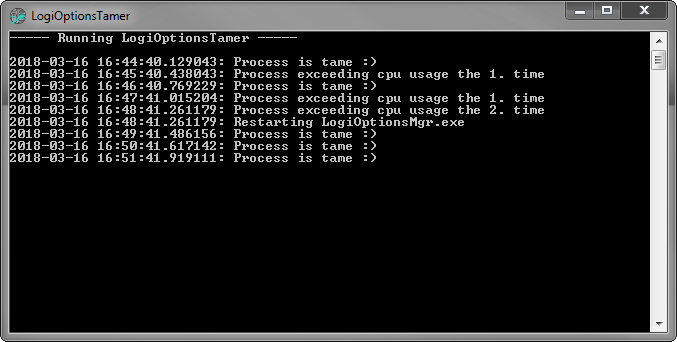

# LogiOptionsTamer
A small Python script keeping Logitech's LogiOptionsManager in check regarding its CPU usage.

The script will periodically check if `LogiOptionsMgr.exe` exceeds a given CPU usage and if so, the process is killed and restarted from its original location (this should account for different install paths). To account for CPU usage spikes due to actual usage, the threshold must be exceeded multiple times before the process is restarted.

The default values for these settings are (you can change them at the top of the script):

| Setting | Default Value |
|---------|---------------|
| Check every | 60 seconds |
| CPU threshold | 5 percent |
| Allowed times above threshold | 1 (meaning if the process exceeds the limit for two times in a row, it is killed and restarted) |

# Usage
If you have Python 3.6 installed, you can start `LogiOptionsTamer.py` directly via

```
python LogiOptionsTamer.py
```
    
Windows users **without a Python installation** can find a release package in the folder `rel`. Here is a direct download link for [LogiOptionsTamer v1.0](https://github.com/Merlin2001/LogiOptionsTamer/blob/master/rel/LogiOptionsTamer%20v1.0.7z). Simply extract the 7zip file to a directory of your liking and start `LogiOptionsTamer.exe`.

# Known issues
Unfortunately, LogiOptionsTamer doesn't start minimized, yet, so I recommend using a tool like [the amazing RBTray](https://github.com/benbuck/rbtray) to minimize it to the system tray.

# Screenshot

